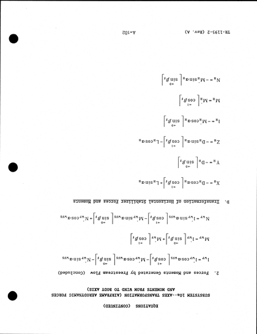
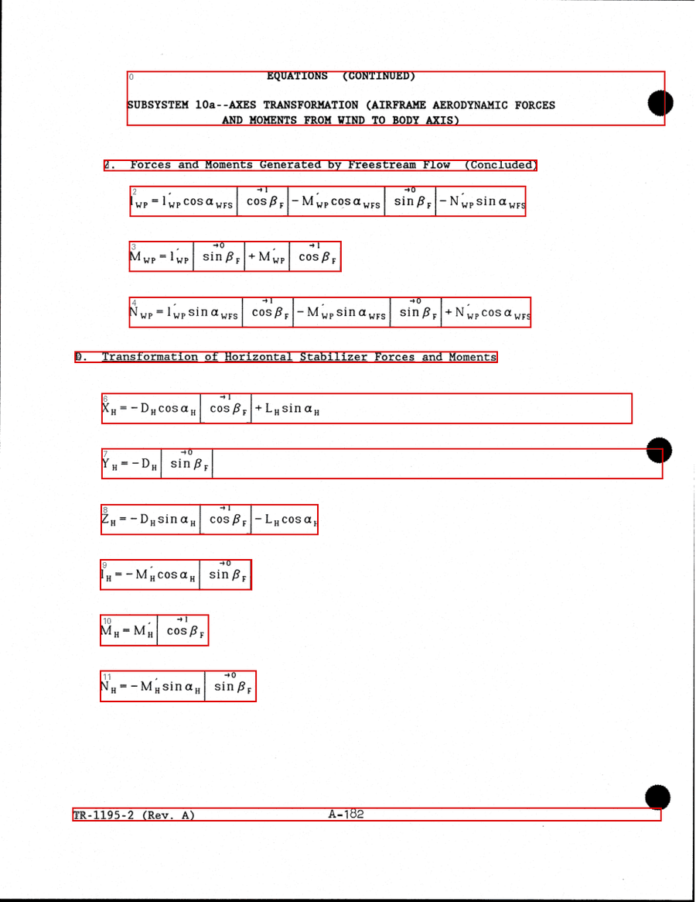
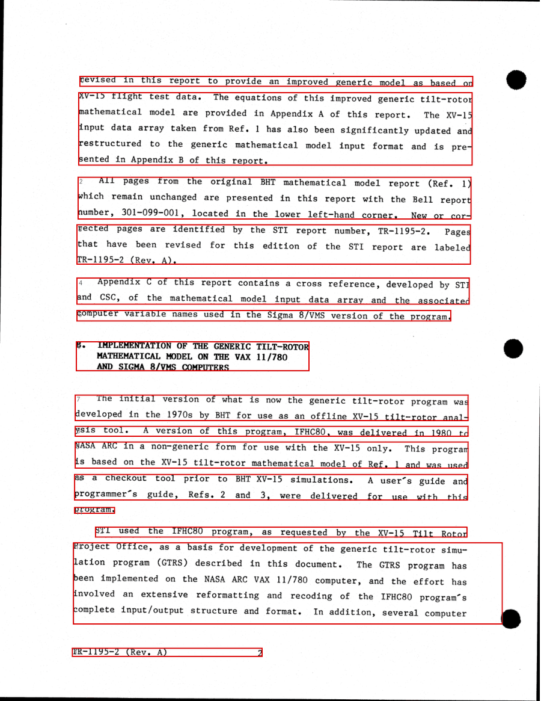
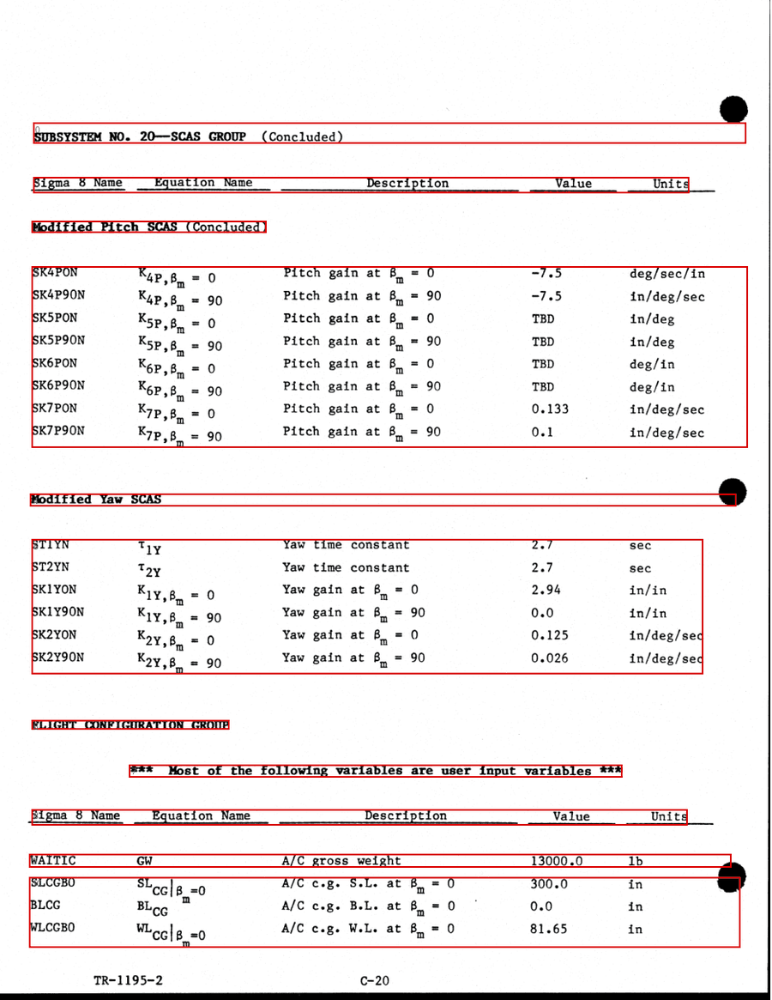
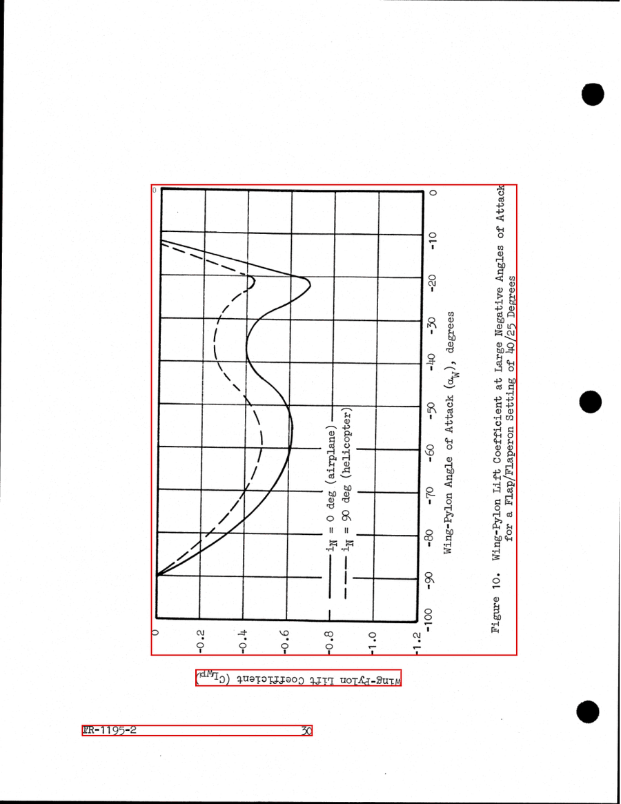
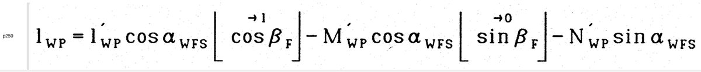
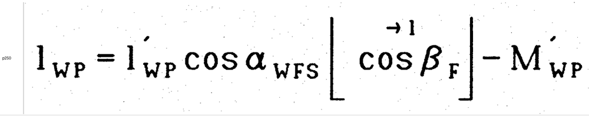
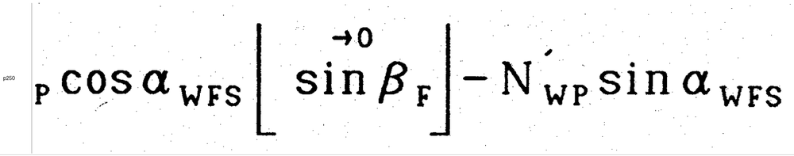
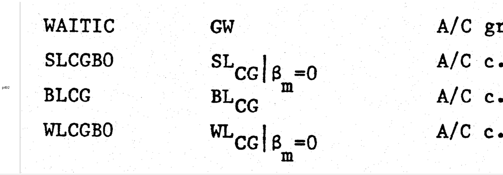

# W0.6／W0.7 測試結果

**工項**　W0.6 影像參數抽樣比較、W0.7 OCR 與 bbox 可用性抽樣測試
**日期**　2026-09-24
**標的**　`source/CR-166536.pdf`（SHA256 `a2013a31…44d67d`，43,869,981 bytes，538 頁）
**結論去向**　`data/meta.yaml` 之 `scan_spec`（G1）、`tools/layout.py`

---

## 0　前提：來源不是我們掃的

在談任何參數之前必須先確立一件事，因為它使 WBS 對 W0.6 的原始設計大部分失效。

| 實測項 | 值 | 取得方式 |
|---|---|---|
| 總頁數 | 538 | `pdfinfo` |
| 文字層 | **無** | `pdffonts` 僅一個未內嵌 Courier；逐頁抽取，538 頁中僅 p.537 有文字物件 |
| 536 頁的內嵌影像 | **1-bit 雙階 PNG，6600×5088** | PyMuPDF `extract_image` |
| 換算原生解析度 | **恰為 600 dpi**（11×8.5 in） | 6600 / 11 in |
| 影像擺放 | 以旋轉矩陣 `(0, −792, 610.56, 0)` 置於直向頁 | `get_image_info` |
| 另 2 頁（p.1、p.537） | 300 dpi、8-bit RGB JPEG | 同上 |

二值化是 2011 年製作此 PDF 時（Xerox DigiPath）就已完成的。**本專案沒有灰階母本**，因此：

- `binarize_algo` 無對象可施，只能是 `none`
- 計畫書 5.8.2–5.8.4 設想的「方案 A／B／C／D 二值化演算法比較」不存在可比較的對象
- 淡字與手寫上下標的存亡在 1988→2011 那次掃描時就已決定，我們無從改善，**只能確保不再二次破壞**

W0.6 的決策空間因此縮小為三項：**下採樣解析度、編碼格式、deskew／crop／rotate**。

---

## W0.6　影像參數

### 1　體積矩陣

8 頁取樣（pdf 50、65、150、218、250、313、400、500，涵蓋文字頁、公式頁、圖版頁），
每頁以 PyMuPDF 渲染為灰階後編碼，取平均，再外推全本 538 頁。

| dpi | webp-lossless | webp-q80 | png-gray | png-1bit |
|---|---|---|---|---|
| 200 | 128.7 MB | 83.7 MB | 167.4 MB | 21.2 MB |
| 300 | 137.6 MB | 166.1 MB | 210.5 MB | 37.3 MB |
| 400 | 164.4 MB | 229.1 MB | 244.5 MB | 55.5 MB |
| **600** | **75.1 MB** | 332.7 MB | 126.8 MB | 99.3 MB |

對照組：直接抽出內嵌的原始 1-bit PNG 不重新編碼 ＝ 205 KB/頁 → 全本 107.7 MB。

**600 dpi 是所有無損選項中最小的**，這不是巧合。600 dpi 等於來源原生解析度，渲染結果
只有 0 與 255 兩個灰階值（已驗證：`np.unique` 回傳 `[0, 255]`），壓縮率極高；
一旦下採樣就產生真灰階，灰階殺掉壓縮率。這也解釋了為何 200→400 dpi 的無損體積
反而隨解析度**上升**。

**有損編碼在此類內容上是純虧。** 600 dpi 的 webp-q80 是無損的 4.4 倍體積，
且不可逆。線稿與打字稿不要用有損格式。

### 2　傾斜量

以列投影變異數最大化量測，範圍 ±1.5°、步長 0.1°：

| 頁 | 50 | 65 | 108 | 150 | 218 | 250 | 313 | 400 | 500 | 520 |
|---|---|---|---|---|---|---|---|---|---|---|
| 傾斜 | +0.90° | −0.40° | 0.00° | 0.00° | −0.50° | 0.00° | −0.30° | 0.00° | 0.00° | 0.00° |

10 頁中 7 頁為 0.00°，最差 0.90°。

**結論 `deskew: false`。** 對 1-bit 影像做旋轉必然重新取樣，結果不是灰階化
（體積依上表漲 2–3 倍）就是再二值化一次（筆畫受損）。收益小、代價不可逆，
且 deskew 是 G1 凍結欄位，中途變更會使全本既有 bbox 全部作廢。

### 3　邊界

含裝訂孔在內的水平墨色範圍為 x = 0.000 ~ 0.998——**裝訂孔黑點就壓在頁緣**。

**結論 `crop: none`。** `auto-margin` 會被孔洞雜訊牽動，使逐頁裁切量不同；
bbox 為相對座標，裁切量不同即代表**頁與頁之間的 bbox 不可比**。

### 4　定案（已寫入 `data/meta.yaml`，G1）

```yaml
method: bilevel-from-source
dpi: 600
format: webp-lossless
binarize_algo: none
deskew: false
crop: none
rotate: none
exceptions: [1, 11, 537]
```

**W1.3 的實作路徑要指定清楚。** 有兩條路都能得到 600 dpi：

- `get_pixmap(dpi=600)` → 5100×6600。頁寬 610.56 pt ＝ 8.48 in，600 dpi 應為 5088 px，
  故此路徑帶有輕微縮放，**不是逐像素等同來源**。
- `extract_image()` → 5088×6600，再 `Image.ROTATE_90` → **逐像素等同來源**，且較快。

**W1.3 應採後者。** 唯一的坑是旋轉方向：`ROTATE_90` 與 `ROTATE_270` 產出的尺寸相同，
光看長寬驗不出來，用錯會得到上下顛倒的整本書。此坑已實際踩過一次——下圖即
`ROTATE_270` 的實際輸出，尺寸 5088×6600 完全正確，內容卻是顛倒的：



這類錯誤沒有任何數值特徵可供自動偵測，只能靠目視。

### 5　例外頁

| pdf 頁 | 狀況 | 處理 |
|---|---|---|
| 1、537 | 300 dpi 8-bit RGB JPEG（封面、Report Documentation Page） | 另一條路徑處理 |
| **11** | **整頁全黑，內容不可回復** | 該頁為目錄尾頁（印刷 vii）。需另尋來源，否則標 `illegible` |

pdf 11 的實際樣貌（60 dpi 縮圖，並非渲染失敗）：


此頁在全本墨色比例統計中是唯一的 1.0，其餘各頁中位數為 0.028，故可由統計值直接
定位，不需逐頁目視。

### 6　本項未做到的事

- WBS 判準寫「同 10 頁」，實際取樣 8 頁。
- WBS 判準「淡字、手寫上下標之保留情形已逐一檢視」**未以目視逐一檢視**。
  改以構造性論證取代：採 600 dpi 無損且走逐像素等同的抽出路徑，輸出與來源
  位元相同，保留率依定義為 100%，無可檢視之差異。若日後改用下採樣方案，
  此判準必須重做。
- **行動裝置解碼**：5088×6600 ＝ 33.6 MP，手機解碼整頁會吃力。可日後補一層
  約 150 dpi 的顯示用小圖。此事不影響 G1，因 bbox 為相對座標，增加顯示層
  不需回填任何既有資料。

---

## W0.7　轉錄管線與 bbox

### 1　分工

本機無 GPU，且來源為乾淨的 1-bit 打字稿，故不採用版面偵測模型。

| 工作 | 由誰 | 理由 |
|---|---|---|
| 版面切割、bbox | 古典 CV（numpy 投影剖面） | 確定性、可重跑、無 GPU；且不會如模型般「補全」不存在的區塊 |
| 區塊內容轉錄 | VLM（Claude Code） | 來源無文字層，別無選擇 |
| 逐字核對 → `reviewed` | 人眼 | 不可外包。本專案排除數值驗證，VLM 幻覺無自動偵測手段 |

### 2　版面切割結果（`tools/layout.py`）

| 頁型 | 樣本 | 切出區塊 | 與人眼判讀比對 |
|---|---|---|---|
| 公式密集 | pdf 250（A-182） | 13 | 一致：頁首 2 ＋ 標題 2 ＋ 公式 9 ＋ 頁尾 1 |
| 純文字 | pdf 16（印刷 2） | 15 | 一致：段落級切割 |
| 數值表格 | pdf 492（C-20） | 11 | 一致：標題／欄位列／群組標題／兩組表體分離 |
| 曲線圖 | pdf 44（Figure 10） | 3 | 一致：整張圖為單一區塊 ＋ 圖說 ＋ 頁尾 |

四張疊圖如下（紅框為程式切出的區塊，藍字為區塊序號）。這四張就是判定「與人眼
判讀一致」的依據——該判定是看圖得到的，不是由任何指標推得。

**公式密集頁 pdf 250（A-182）**　9 條式子各自獨立成塊，標題與頁首頁尾分離：



**純文字頁 pdf 16（印刷 2）**　段落級切割：



**數值表格頁 pdf 492（C-20）**　標題、欄位列、群組標題與兩組表體分離；
右側的裝訂孔黑點已被排除在所有 bbox 之外：



**曲線圖頁 pdf 44（Figure 10）**　整張圖為單一區塊。此圖同時顯示了圖表是
**橫向印刷**的——原文的圖必須旋轉才能閱讀：



### 3　過程中發現並修正的三個缺陷

這三項都**不會報錯**，只會靜默產生錯誤資料，記錄於此以免日後重蹈。

**（a）裝訂孔逐頁左右交替。** 左頁在 x ≈ 0.04–0.07，右頁在 x ≈ 0.94–0.96。
未處理時，孔洞黑點會把同高度**所有**區塊的 bbox 一路撐到頁緣——是一個橫跨全本的
系統性偏差。固定切邊亦不可行：附錄 C 數值表的左欄（FORTRAN 變數名）起於 x ≈ 0.06，
與左頁孔洞重疊，切孔就會一併切掉內容。最終採「只遮去孔洞本身」，
以連續墨色長度判別（孔的水平連續墨色達約 0.022 頁寬，打字稿筆畫不會如此）。

**（b）以 `any()` 取欄位範圍會被單一雜點撐爆。** 改為要求該欄至少兩個墨色像素。

**（c）區塊合併門檻。** `gap_ratio = 1.1` 會把整頁公式併成**一個**區塊；
0.4 得 13 塊（與人眼一致）。預設值定為 0.45。

### 4　轉錄準確率

| 頁型 | 測法 | 結果 |
|---|---|---|
| 純文字 | 目錄頁 pdf 7–14 於 150 dpi 渲染下判讀 | 完整可讀，無疑義字元 |
| 公式密集 | 同一條式子分別以全寬（有效約 218 dpi）與左右半幅（約 440 dpi）判讀後比對 | **兩者完全一致** |
| 數值表格 | 整頁判讀與原生解析度裁切判讀比對 | **發現一處真實錯誤，見下** |
| 曲線圖 | pdf 44 目視評估 | 曲線清晰、座標軸與圖例完整，可交 T3 數化 |

公式一致性測試所用的三張裁切如下。同一條式子，上為全寬單張，下為左右半幅：







兩種解析度讀出的結果相同，包括 `α_WFS` 的細下標與方括號上方的 `→1`／`→0` 標記。

**唯一實測到的錯誤與解析度無關，來自裁切幾何。**
pdf 492 第一欄的變數名，我在一張 `x0 = 0.05` 的條帶上讀為 `ALTIC`；
以原生解析度重裁後確認實為 `WAITIC`：



首字母被裁切掉，而**剩下的部分仍是一個看起來合理的字串**——沒有任何跡象顯示
發生了截斷。同樣地，`SLCGBO` 會被讀成 `LCGBO`、`WLCGBO` 會被讀成 `LCGBO`，
兩者還會塌縮成同一個值。

> **對策（須寫入 W4.0 的 SOP）**：bbox 各邊留 0.005–0.01 的邊距，
> 轉錄用的裁切一律不得貼齊內容邊界。

**有效解析度上限。** VLM 讀圖時影像會被降採樣到長邊約 1568 px，因此一個
橫貫版面的區塊，其有效解析度上限約為 **218 dpi**。實測對這份打字稿足夠；
若日後遇到手寫符號頁，須將區塊再水平切半處理。

### 5　bbox 結論

**可用。** W0.7 判準「版面偵測能否輸出可用 bbox」答案為**能**，
因此 T2.1（bbox 自動回填）不需取消，且屬順手產物而非額外工項。
座標一律為相對值 `[x1, y1, x2, y2]`、原點左上、相對於整頁，不因 dpi 變更失效。

### 6　附帶發現

**（a）圖表為橫向印刷，且旋轉方向兩種都有。** 圖 2–7 與圖 8–18 方向相反。
F3 掃描對照與 T3 數化都不可假設單一旋轉方向，須逐頁記錄。

**（b）第一個 `schema_gap` 候選。** pdf 250 的式子中，`⌊cos β_F⌋` 上方標 `→1`、
`⌊sin β_F⌋` 上方標 `→0`，表示某條件下該項退化為常數。既非 `piecewise`
亦非普通上標，現行 schema 裝不下。該式完整轉錄為：

```
l_WP = l'_WP cos α_WFS ⌊cos β_F⌋^(→1) − M'_WP cos α_WFS ⌊sin β_F⌋^(→0) − N'_WP sin α_WFS
```

此記法在附錄 A 極可能大量出現，須在 W2.2 前確認其表達方式。

### 7　本項的限制

**準確率無法自我認證。** 轉錄者與判讀者是同一個 VLM，因此本節量到的是
**跨解析度的一致性**，不是對照真值的正確率。一致不代表正確——兩次都錯成同一個
結果是可能的（`ALTIC` 那次若沒有改用原生解析度重裁，就會一致地錯下去）。
真值只能由人眼逐字核對提供，這正是 `reviewed` 狀態的定義所在。

---

## 附錄　本次目視檢視過的影像

P0 期間共目視檢視 **41 張**影像。這點值得明白記錄：本報告與 `meta.yaml`、
`modules.yaml`、`toc.yaml` 中的每一項結論，都是先看圖才下的，沒有一項是從
統計量直接推斷的。統計量（墨色比例、橫線覆蓋率、字串寬度）只用來**決定要看哪幾頁**，
判讀一律由目視完成。

進版控的 10 張見 `docs/img/`（共 701 KB）；其餘存於 `work/`（未進版控），
以下列指令可重建。

### W0.6 影像參數

| 檢視對象 | 確立了什麼 |
|---|---|
| pdf 11（全頁） | 整頁全黑，內容不可回復 → `scan_spec.exceptions` |
| `ROTATE_270` 輸出 | 旋轉方向錯誤時尺寸正確但內容顛倒 → W1.3 須用 `ROTATE_90` |

### W0.7 版面切割與轉錄

| 檢視對象 | 確立了什麼 |
|---|---|
| pdf 250／16／492／44 的疊圖 | 四類頁型的切割結果與人眼判讀一致 |
| pdf 250 一式的全寬／左半／右半裁切 | 兩種有效解析度的判讀結果相同 |
| pdf 492 左欄原生解析度裁切 | `ALTIC` 實為 `WAITIC`——裁切幾何造成的靜默截斷 |

### W0.1／W0.3／W0.4 結構盤點

| 檢視對象 | 確立了什麼 |
|---|---|
| pdf 1、3 | 封面與書名頁：報告編號、合約 NAS2-11317、1988 年 Rev. A |
| pdf 537 | Report Documentation Page：distribution statement、自述 533 頁、執行單位 STI |
| pdf 7、8 | Abstract 與 Foreword：模型源自 BHT、Appendix C 由 STI 與 CSC 合作 |
| pdf 9、10 | 目錄：第 I–III 節，subsystem 1–19 |
| pdf 12、13、14 | List of Figures：本文 18 幅圖，無表目錄 |
| 頁尾條帶 ×3（pdf 1–16、全書散點、交界） | `page_map` 全部區間邊界 |
| 附錄首頁條帶 ×2 | 四個附錄的標題；第一次裁切帶取錯位置（全空白），第二次才取到 |
| pdf 248–255 連續頁首條帶 | **發現附錄 A 的三種頁型輪替**，此前的頁首比對法失敗原因 |
| 方框頁抽樣條帶 ＋ 分批框題條帶 ×5 | 27 個 subsystem 的編號、名稱與頁範圍 |
| pdf 208–215 頁首條帶 | 找到 subsystem 8d（PILOT'S CONTROL FUNCTION） |

### W0.2 授權標示

| 檢視對象 | 確立了什麼 |
|---|---|
| 頁尾分群抽樣條帶 ×2 | 三種頁尾編號各對應哪一群寬度 |
| 未分類頁尾條帶 | 未分類原因為殘留孔洞碎點，非另有第四種編號 |
| BHT 判定覆核條帶 | 7 頁抽樣全部確認為 `301-099-001`，零誤判 |
| 本文 18 幅圖的圖說條帶 ×3 | 無來源標註、無版權符號；圖的旋轉方向有兩種 |

### 兩次「看了才發現搞錯」的記錄

1. **附錄首頁條帶第一次全空白**（裁切帶取 y 0.06–0.36，而附錄扉頁標題在頁面中段）。
   若當時據此認定「附錄首頁無標題」，四個附錄的名稱就會全部缺漏。
2. **subsystem 8d 一度被當成偵測假陽性**。程式確實把 pdf 212 列為方框頁，
   但我覆核時的裁切帶自 y 0.075 起，而該頁框題位置較高，落在裁切帶之上，
   於是被我剔除。**偵測沒錯，覆核的取樣窗錯了。**

兩次都是同一種錯誤：拿一個固定的裁切窗去看版面位置會浮動的東西。
這也是本報告把「bbox 必須留邊」列為 SOP 要求的原因。

---

## 重現方式

```bash
uv venv .venv --python 3.12
uv pip install --python .venv/Scripts/python.exe -r tools/requirements.txt

# 版面切割與疊圖
python tools/layout.py --page 250 --out work/layout_250.json --overlay work/layout_250.png

# 條帶拼版（頁尾、頁首、任意橫帶；--rotate 供橫向印刷的圖表使用）
python tools/strip_sheet.py --pages 1-16 --band footer --out work/foot_001.png

# 附錄 A 頁型判別
python tools/section_scan.py --pages 69-350 --out work/section_breaks.json

# 頁尾報告編號來源掃描（W0.2）
python tools/footer_scan.py --out work/footer.json
```

`work/` 未進版控；上列產物可隨時重建。
