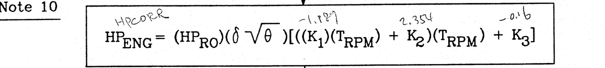
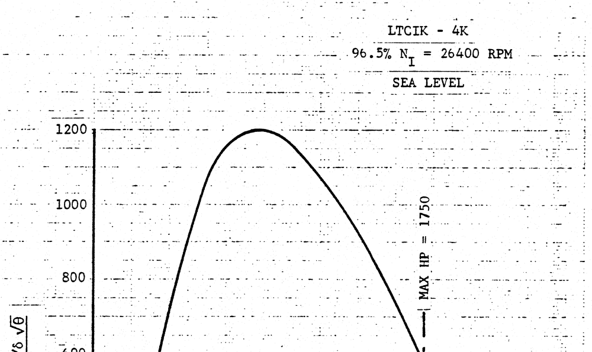
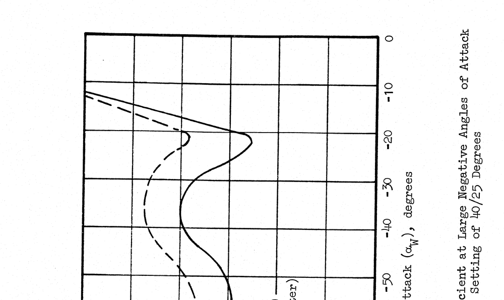

# W1.4 逐頁抽檢結果

**工項**　W1.4 逐頁目視抽檢與例外處理
**日期**　2026-09-25
**標的**　`scans/p001.webp` … `p538.webp`（W1.3 產出，538 頁）
**結論去向**　`data/coverage.yaml` 之 `issues`、WBS W1.4 判準、`tools/page_audit.py`

---

## 0　前提：W1.3 的結果使本工項的一半失去對象

W1.4 在計畫書中的定位是「commit 前唯一一次攔下品質問題的機會」，其四條重點判準
（手寫、污損疊影、圖表）全部源自 **R9　二值化切除淡化手寫符號，造成不可逆資訊損失**。
5.8 節寫得很明確：「淡字可能消失（不可逆）」「淡化的手寫上下標可能被閾值整個切除」。

但 W1.3 定案的管線是 `binarize_algo: none`，輸出為內嵌影像原樣抽出，
**與來源逐像素相同**（10 頁隨機抽查 ＋ 每頁往返比對，全數通過）。

**我們沒有做二值化，因此沒有「被二值化切除」這回事。R9 在本管線上不是機率低，
是結構上不可能發生。** W0.6 其實已經給過答案——「淡字與手寫上下標的存亡在
1988→2011 那次掃描時就已決定，我們無從改善，只能確保不再二次破壞」——逐像素相同
就是「未二次破壞」的證明。

本工項因此重新定位為**來源品質盤點**：不再問「我們有沒有弄壞」，改問「來源本身
有什麼問題會影響後續轉錄與數化」。發現一律記入 `coverage.yaml` 的 `issues`。

---

## 1　方法

| 階段 | 作法 | 產出 |
|---|---|---|
| 1 | `tools/page_audit.py` 逐頁量測六項指標，閾值取全本分佈百分位 | `work/page_audit.json` |
| 2 | 依指標取出離群頁，分類拼版粗掃 | 58 頁（佔 10.8%） |
| 3 | 對粗掃有疑者以原生解析度裁切細看 | 本文之發現 |

指標本身不下判斷，只用來**決定要看哪幾頁**；一切歸類由目視完成。這與 P0 的作法一致。

**另有一次獨立的人工比對**（Ricky Wu，`work/w14-review.json`，透過
`tools/make_review.py` 產生的審閱頁面）。該次比對的範圍是**顯示影像與來源 PDF 是否一致、
以及印刷頁碼是否正確**，538 頁全數通過。其價值在於：
- 為 W1.3 的保真度提供人眼佐證
- 把 W0.5 的 `page_map` 驗證從九個取樣點擴大到全本 538 頁

該次比對**不涵蓋影像品質判讀**，故不作為本文四項發現的來源，兩者是互補而非重複。

---

## 2　發現

### 2.1　pdf 333（A-265，Figure A18-1）　式子上有手寫數值　不轉錄



```
   HPCORR              -1.189?        2.354       -0.16
      ↓                   ↓             ↓           ↓
HP_ENG = (HP_RO)(δ√θ)[((K_1)(T_RPM) + K_2)(T_RPM) + K_3]
```

手寫體為 `K_1`、`K_2`、`K_3` 各填上數值，並在 `HP_ENG` 上方標註 `HPCORR`。

**處置：不轉錄**（WBS 決議 #6，2026-09-25）。

本頁一度被當成「手寫的原文內容如何進 schema」的待決案例，實際查證後三點都不成立：

- **手寫不是 Ferguson 打字原文**，而是後人在影本上所加，寫的人不明
- **手寫沒有補上任何缺漏。** `K_1`–`K_3` 已由 pdf 324（A-256）的 I/O 摘要頁正式宣告為
  subsystem 18 的 Coefficients（`K_1 → K_7, K_11 → K_18, …`），權威數值應在附錄 C 的
  FORTRAN 常數表。`HPCORR` 同理，很可能是 `HP_ENG` 的 FORTRAN 名，附錄 C 本就是
  做此對照。手寫填的是既有欄位的值，屬冗餘註記
- **資訊不會遺失。** F3 掃描對照呈現原始頁面影像，手寫仍然看得到

故 `coverage.yaml` 中本頁不計為 `issue`，僅以 `note` 記錄手寫存在，以免日後重新提起。
schema 不需新增欄位承接手寫，W2.2 少一項待決事項。

若日後遇到手寫**確實補上原文缺漏**的案例（例如原文未宣告的符號），決議 #6 應重新檢視。

### 2.2　pdf 464（B-114，Figure B18-1）　圖表格線散失　`illegible`



格線幾乎整片消失，僅餘散點碎屑；**曲線、座標軸、刻度標籤完好**。該頁雜點數 1781，
全本中位數 5、95 百分位 12——是全本最極端的離群值。

**已經人工核對確認為來源既有，非本專案轉檔造成。** 影響 T3 曲線數化的參考基準。

對照組是正文圖版，格線完好：



**損傷不是全書均勻的**——正文 Figure 8–17（pdf 42–54）格線全部完好，
散失集中在附錄 B 的個別頁。這代表 T3 不能假設所有曲線圖品質一致，須逐圖確認。

### 2.3　pdf 5（書名頁）　手寫註記

鋼筆手寫電話與地名，另有網點戳記壓在 "SYSTEMS TECHNOLOGY, INC." 之上。
同樣依決議 #6 不轉錄，`coverage.yaml` 以 `note` 記錄，不計為 `issue`。

### 2.4　pdf 2（印刷頁 10）　空白頁墨漬

空白頁中央有墨漬團塊（轉印或污染），全頁另有散布雜點。無內容影響，不另記 `issues`。

---

## 3　良性誤報

指標命中但目視確認無事者，列出以免日後重查：

| 頁 | 觸發指標 | 實際是什麼 |
|---|---|---|
| 286、292、303、308、336 | `max_comp_frac` | 帶大方框的 I/O 摘要頁，指標抓到方框邊 |
| 411、417、418、421、423、424、427、428、431、433 | `edge_ink` | 附錄 B 數值表頁（Table 5-II／6-II／7A-I），乾淨 |
| 361 | `speckle_count` | CG 包絡圖的剖面線陰影，屬內容 |
| 2、4、6、14、24、62、64、68 | `row_regularity` | 空白頁，指標在無內容時退化 |
| 92、130、131、132、134 | `row_regularity` | 流程圖與方塊圖（含 Figure A1-3） |
| 22、188、197、201、218 | `speckle_count` | 密集圖表與式子（Figure 1、A8a-1、A8d-4） |

**`max_comp_frac` 分不開圖版與大方框**，這是已知限制，已寫入腳本說明。

---

## 4　手寫偵測：兩次失敗的完整記錄

在確認 R9 不成立之前，我先嘗試為「含手寫符號之頁面已重點檢查」建立偵測指標。
兩種設計都失敗，記錄於此以免日後重做同樣的嘗試。

真值頁為 **pdf 333** 與 **pdf 5**（兩頁均經目視確認含手寫）。

| 指標 | 設計 | pdf 333 | pdf 5 | 最高誤報 |
|---|---|---|---|---|
| `tall_frac` | 元件高度大於 2.5 × 本頁中位數者的佔比 | 0.113 ✓ | **0.000 ✗** | pdf 361 剖面線 0.322 |
| 網格局部異質 | 8×6 網格，各格筆畫半寬中位數低於全頁主導值 0.62 倍者的佔比 | **0.000 ✗** | 0.227 ✓ | pdf 361 剖面線 0.161 |

**失敗原因不同，但都是結構性的：**

- **pdf 5 打敗頁層級指標。** 該頁的手寫加上網點戳記本身成為多數族群，頁中位筆畫
  半寬被拉到 3.16（打字區為 7.07），於是「比本頁中位數細」的元件一個也沒有。
  自我正規化在異質族群佔多數時失效。
- **pdf 333 打敗網格指標。** 手寫只佔一條約 130 px 高的帶（全頁 6600 px），
  在 8×6 網格下與底下的打字式子共用同一格，格內中位數被打字筆畫吃掉。
  要讓它獨立成格需切到約 50 列，但那時每格元件數不足以算出穩定中位數。

這是解析度與統計量的取捨，不是參數沒調好。且 pdf 361 的剖面線在兩種設計裡都排前段，
誤報也壓不下去。

**更根本的是這件事本來就不必做。** 見第 0 節：偵測手寫的目的是查驗 R9，而 R9 不成立。

而在 2.1 查清楚之後，連下游需求也不存在了——決議 #6 定案**來源上的手寫一律不轉錄**，
既然不轉錄，就沒有「要先找出哪幾頁有手寫」的理由。這個偵測需求是從一個已經失效的
前提（我們會二值化）推導出來的，我卻直到實作了兩種指標之後才回頭去問它為什麼存在。

計畫書 R3 的「手寫上下標無法辨識」仍然成立，但那說的是**打字式子中的手寫上下標**
（原文排版的一部分），與後人在影本上加註不是同一回事，其應對計畫書已寫明為
「標記 `status: draft` 與 `issues`」，同樣不是偵測。

`tall_frac` 已自 `tools/page_audit.py` 移除。

---

## 5　判準變更

| 判準 | 處置 |
|---|---|
| 含手寫符號之頁面已重點檢查 | **刪除**，改為 ▸ 記錄。前提 R9 不成立 |
| 例外頁已改以灰階重轉並回填 `scan_spec.exceptions` | 已於開工前改寫（來源無灰階母本） |

---

## 6　本項未做到的事

- **未執行全本 538 頁的 1-up 目視。** 實際作法是指標篩選 58 頁（10.8%）後分類細看。
  未被任何指標命中的 480 頁，只經過 W1.3 的方向相關係數與墨色比例等自動檢查，
  以及上述人工的「與 PDF 一致」比對。
- **附錄 B／C／D 共 186 頁若有手寫，本次不會發現。** 那些頁在 P4 可能不會逐頁細看，
  應由 `coverage.yaml` 台帳保證每頁至少被處理一次（W1.7、W3.5）。
- **本文的判讀由 VLM 完成，不等於人眼核對。** 依專案慣例，機器判讀一律視為 `draft`；
  `coverage.yaml` 中四筆標註的文字內容尚未經人眼逐字覆核。

---

## 重現方式

```bash
# 逐頁指標
python tools/page_audit.py --top 12          # → work/page_audit.json

# 審閱頁面（自足 HTML，file:// 可開）
python tools/make_review.py                  # → work/review.html
```

`work/` 未進版控；上列產物可隨時重建。
